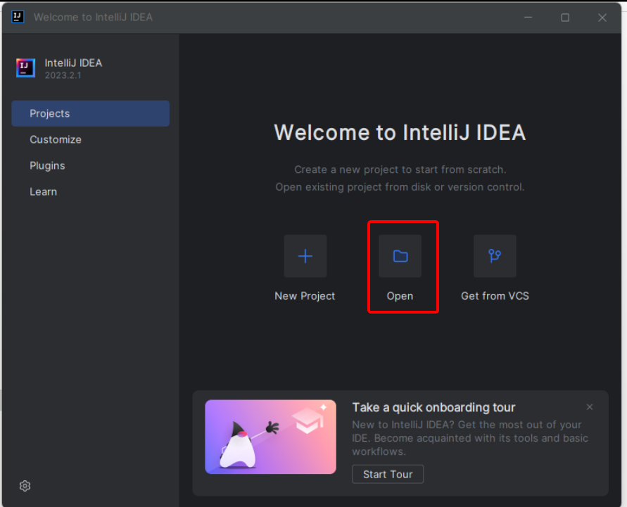
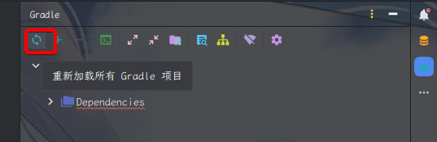
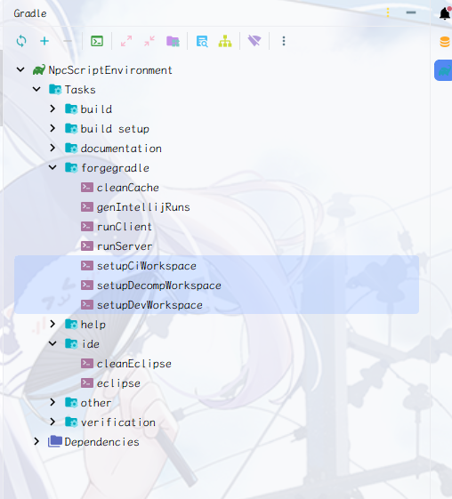
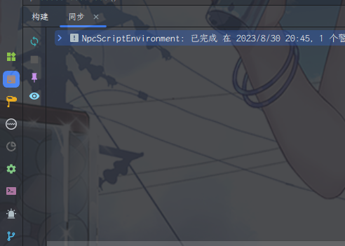

## 一、开发环境

只要按着教程一步一步走，一般就没什么问题

### 安装JDK

- [点我下载Zulu JDK](https://www.azul.com/downloads/?version=java-8-lts&os=windows&architecture=x86-64-bit&package=jdk#zulu)
- 无脑下一步

###  下载 IDEA

- 请打开[idea community](https://www.jetbrains.com/idea/download/?section=windows)，向下翻找找到`IntelliJ IDEA Community Edition`

- 点击下载

- 双击安装包

- 无脑下一步

- 恭喜你完成了

### 下载开发环境

请在以下方式中选择一个，推荐使用Github

- [Github下载链接](https://codeload.github.com/MineCraftGensoukyo/NpcScriptEnvironment/zip/refs/heads/main)
- 群文件内下载

请解压到一个你想要的位置，这里我是`F:\code`，下面我将会使用这个路径作为示例

###  构建环境

点击`Open`

在 IDEA 内打开 `F:\code\NpcScriptEnvironment\build.gradle` 这个文件

点击作为项目打开

右边你会找到一个大象一样的图标

请点开这个侧边栏，并点击`重载所有Gradle项目`，如果是灰色的说明已经在构建中

不过或许你那边没有中文，看着点就是了

等待`Gradle`构建完成，请运行以下三个Task

- setupCiWorkspace
- setupDecompWorkspace
- setupDevWorkspace

接下来你会看见IDEA正在构建，等待他出现完成以后并且不是红色的警告，说明已经构建成功了，恭喜你

