**MCG脚本开发入门**

1.  脚本简单介绍

脚本，是基于mod CustomNpcs的一种用于拓展实现更多玩法的工具。虽然功能不如插件、mod一样强大，但其独特的热更新特性（随时修改，无需重启服务器）和环境搭建的简易性，无疑是最易入门的高级MC开发工具。熟悉cnpc脚本之后，对步入插件、mod的开发也更为容易。

脚本的适用性非常广泛，MC幻想乡服务器中、副本系统、试胆大会活动等玩法均由脚本实现，从副本boss到普通的野怪的特殊技能均由脚本编写而来，由此说明——脚本，是一种灵活且强大的工具。

脚本的开发是一种程序设计（编写代码），如果你有相关编程基础，你的入门将会非常顺利。目前，服务器上的脚本主要使用三种语言——Java、Kotlin、Groovy。JavaScript因性能等问题已逐步淘汰，在本教程中，我们将展示使用Java进行脚本开发的方法步骤。

1.  Java脚本编写工具推荐

由于使用cnpc模组自带的脚本编辑器编写脚本效率较低且没有自动补正和错误提示等功能，所以我们需要选择一些开发工具帮助我们更加效率地进行脚本开发。

最适合Java开发的软件是IDEA，下载网址：https://www.jetbrains.com.cn/idea/features/

推荐下载IDEA社区版：

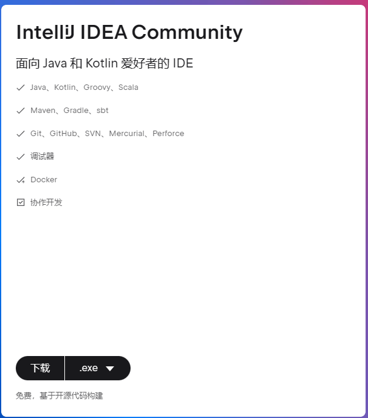

打开IDEA进行环境配置，环境配置方法参见群文件《脚本编写环境构建教程_v1》

1.  Java脚本开发的第一步

开发工具环境配置完成后，搭建脚本测试环境，推荐使用群文件中的本地测试服进行测试（更接近服务器的脚本开发），在本地测试服安装群文件的依赖mod_java_kt，启动服务器（服务器命令行窗口可以给自己op权限，然后把模式改成创造模式），进入游戏，我们会发现多出了“自定义npc工具”这一栏选项，我们常用的是下图这几个工具

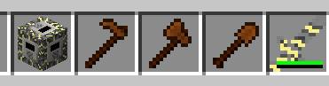

使用锄头形状的npc魔杖右击空地，我们可以创造一个npc，使用铲子形状的npc脚本魔杖右键该npc进入该npc的脚本编辑模块。

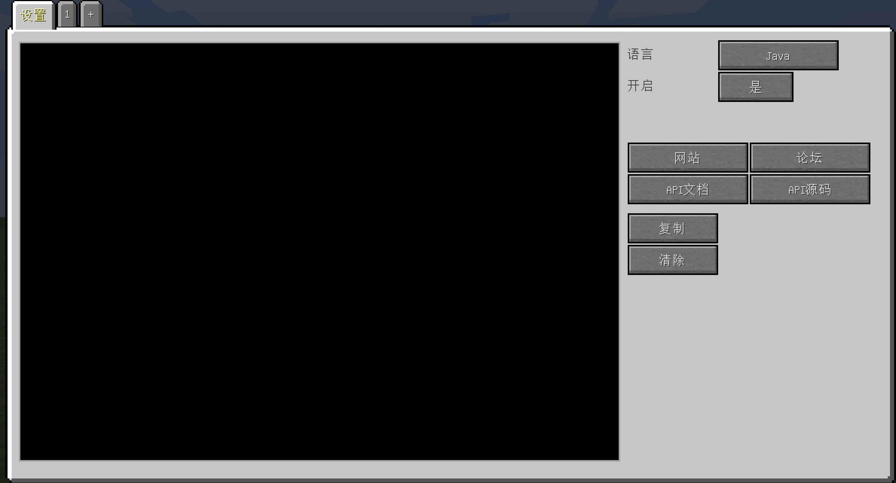

如图所示，这就是脚本编辑的首页。右上角的开启对应着是否开启该npc的脚本，语言代表执行脚本的引擎，Java语言对应的引擎是Java。将开启改为是，点击左上角的加号，就来到了第一个脚本的脚本编辑区，在这里可以将写好的脚本放入npc执行。先不考虑工作原理，将下面的代码复制进去，按esc退出，右键npc，如果在左下角看到“Hello World!”的字样，那么恭喜你，你的第一个脚本就完成了！

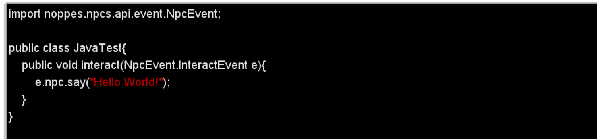

1.  使用cnpc的网页文档进行脚本开发

首先介绍一个网址：Overview (kodevelopment.nl)，这个网址包括了cnpc提供的一切接口和方法（部分方法可能不可用，具体可以在IDEA中查看CustomNPCs_1.12.2-(05Jul20)-deobf.jar中的方法），这个网址是脚本编写过程中的“大词典”，接下来的内容中统称为“api文档”。收藏该网址后就可以着手开始脚本开发了。

以上面完成的输出“Hello World”的脚本为例，在编写脚本前，我们首先应该考虑如果使脚本运行，即脚本的运行条件，是被玩家右击互动时？还是受到攻击时？或是每tick都需要执行？这些运行事件统称为事件（event），而能够侦测到这些事情发生的侦测器称为钩子（hook），对于一个npc，钩子列表可以在api文档中查看：NpcEvent (kodevelopment.nl)，表格中最右一列Description就是这些钩子的名称。当我们在程序中使用这些钩子作为函数时，npc遇见这些事件时就会执行脚本内容。

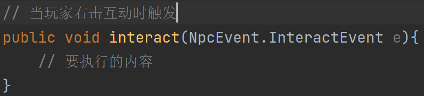

比如这段代码，意思是当npc被玩家右键互动时（Interact事件），就会执行大括号中的内容。

需要注意的是。当你使用这个钩子时，传入了一个NpcEvent.InteractEvent类的对象e，所以需要在代码上方导入NpcEvent包，使用NpcEvent类中的内部类InteractEvent接收这个对象，否则编译器就会找不到对应的方法。

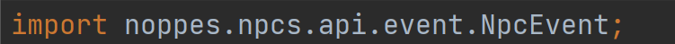

一般来说，使用搭建了环境的开发工具（比如IDEA）在需要导入类的时候会自动帮你加上import相关的语句。

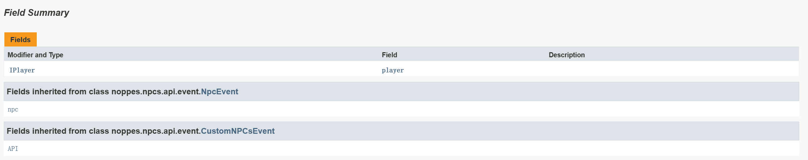

在api文档中查询NpcEvent.InteractEvent可以查看关于这个钩子的详细说明，如上图所示，其中player代表了玩家对象实体（object）即玩家本人，npc代表了npc的对象实体。API 则是包括了 cnpc 所有内容的 API 类(class)。这些信息通过上述脚本的 e 传入脚本，要调用玩家实体时，使用 e.player。

IPlayer中的player是类名，点击IPlayer，可以查看所有与IPlayer类相关的所有对象（即所有玩家）可以调用的方法（method）。

比如上图的getHunger()方法，方法名称前的int是该方法返回值类型，即整型。调用该方法会返回一个代表玩家饱食度的整数。

又比如上图的setHunger()方法，顾名思义可以用来设置玩家的饱食度，括号内的int level代表调用这个方法需要传递一个整数类型的参数，这样才能告诉这个方法你需要把饱食度设置为几，而这个方法的返回值为void（空），即调用这个方法没有返回值。

需要调用这些方法时，在该类对象后加上“.方法名(传入参数)”即可。

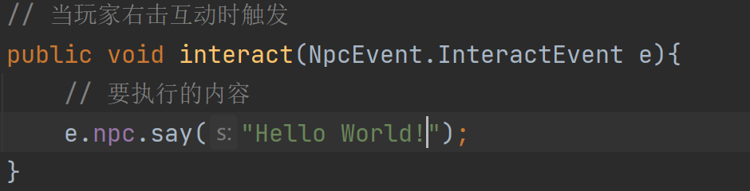

例如e.npc.say(“Hello World!”)，即对Interact事件中的npc调用say()方法，在say方法中传入一个字符串类型（String类型）的值“Hello World!”。这样右击互动npc时npc就会说出Hello World!的字样。

通过上方的描述，你不难发现，方法的命名具有望文生义的特点，比如“设置饱食度”的方法名为setHunger，“说”的方法名为say。方法这样命名的好处是方便读者理解这个方法的具体意思，在api文档中，我们也能利用这种命名方法快速找到我们需要的方法。比如，我想查询有关“血量”的方法，在api文档右上角搜索栏中输入“health”，就能发现所有与血量相关的方法。

细心的读者可能会发现，IPlayer类中并没有setHealth()，getHealth()这种方法，反而是IEntityLivingBase中有这类方法，下面我们就来讲讲关于面向对象的一大特性——继承。

1.  面向对象

在脚本学习过程中，我们会逐渐了解到脚本由三个主要成分构成。它们分别是对象、类和方法，每个对象属于一个类，而每个类包含许多方法。比如roughDO、Xing_ceng 和 DavidWang19，在cnpc中都属于IPlayer类，但实际上，上述实体不仅仅可以被归类为“玩家”，也可以被归类为生物、实体（IEntity）类，一个玩家对象显然应该也可以调用生物类的方法和实体类的方法，这样自然而然地，一条继承链就形成了。

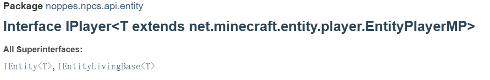

回到api文档中的IPlayer类，我们可以在All Superinterfaces下看到IPlayer类的所有祖先类。

在这里我们可以发现 extends 代表继承，IPlayer 类继承了 IEntityLivingBase 类，即生物类，称 IPlayer 是 IEntityLivingBase 的子类，IEntityLivingBase 是 IPlayer 的父类。如果我们点进 IEntityLivingBase 的页面，我们会发现它继承了IEntity 类，即实体类，这样，这两个类都是 IPlayer 类的祖先类。一个子类可以调 用它所有祖先类中的方法（即一个玩家也是生物，当然可以调用适用于所有生物 的方法），而我们在 IEntityLivingBase 类中就可以发现 getHealth 这个获取生物当 前血量的方法，一个玩家实体就可以直接调用这个方法了，例如以下代码：

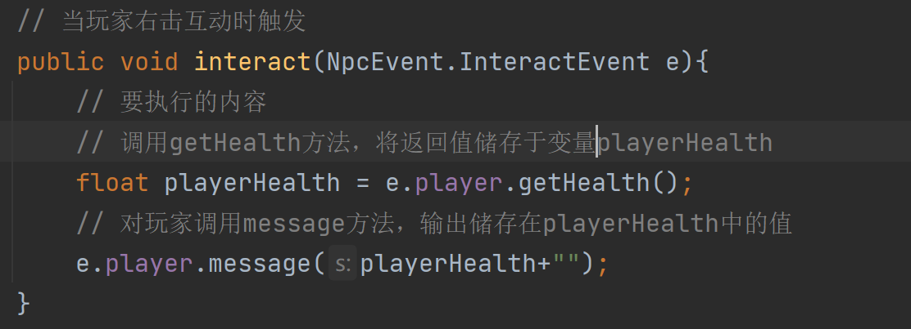

需要注意的是，getHealth()方法的返回值类型为float，而调用message方法传入的参数值类型为String，与JavaScript不同，这里需要进行强制类型转换，Java在传入参数后加上 +“” 即可完成转换。

1.  Java基本语法结构

Java相关语法教程可以参考：[Java 教程 \| 菜鸟教程 (runoob.com)](https://www.runoob.com/java/java-tutorial.html)，或者在b站搜索相关教程，学完面向对象即可。

Java定义变量的方法为：类名+变量名，变量名不能为void、float等关键词，基本数据类型包括boolean、int、float、double等，诸如IPlayer、IEntity这些类型为引用类型。无论哪种类型，在定义变量时都需要在变量名前声明变量的类型。

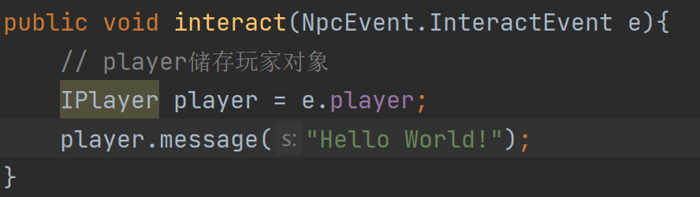

这里等于号的含义是赋值，即将等于号右侧的值赋给左侧的变量，而不表示判断两侧是否相等，当想判断相等时，应当使用双等于号==。在程序中，我们用变量 来存储一些需要用到的信息，同时也可以减小代码量，如用 player 存储 e.player，在 定义变量后的程序中就可以用 player 代表 e.player 了。

在对象类型中，数组极为重要，虽然名字叫数组，但数组中可以存放任何对应类型的对象。数组根据内部存储数据的不同称作不同数组，如存放整型数据的数组称为整形数组，存放字符串的数组称为字符串数组等。数组可以通过以下方式新建：

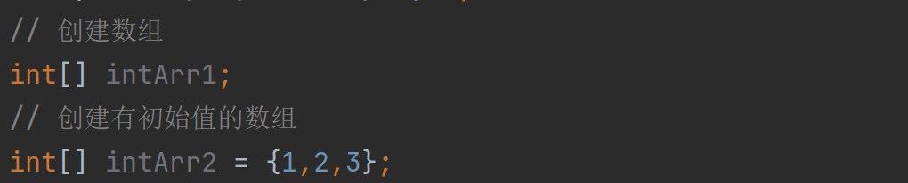

如果你查看过JavaScript的脚本编写教程，你会发现Java版的数组并没有和JavaScript一样灵活的数组操作功能。这是因为在Java 中，数组是一种固定长度的数据结构，一旦创建后其长度就无法改变。虽然 Java 语言本身提供了一些数组操作的方法，比如 System.arraycopy 用于数组复制，以及 Arrays.sort 用于数组排序，但是对于动态增删元素这类操作，需要开发者自行编写代码来完成，或者使用集合类（如 ArrayList）来代替数组完成这些操作。这里推荐使用ArrayList：

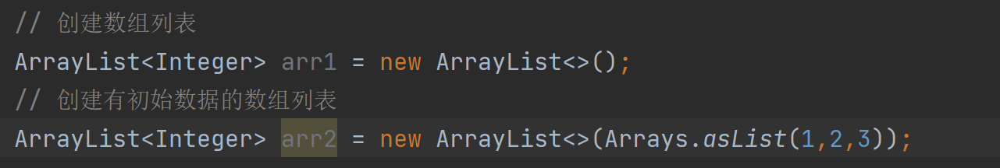

需要注意的是，不同于普通的数组，ArrayList不能直接存储基本数据类型，需要通过相应的包装类实现，比如int类需要通过包装类Integer进行存储。ArrayList中有以下几种常用方法：

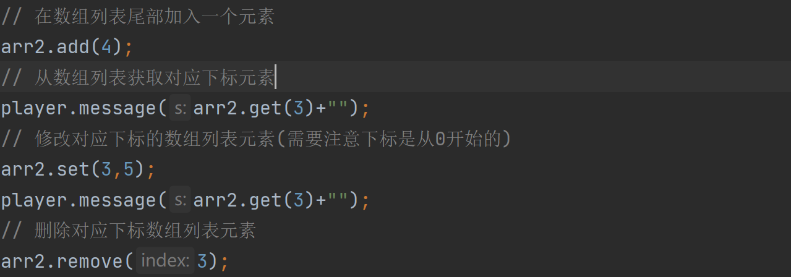

如图所示，数组的下标是从0开始，也就是说使用get()方法传入的参数i实际上获取到的是第i+1个元素。在 cnpc 网页文档中，返回值为“类型[]”样式的即表明返回一个该类型的数组，如 getNearbyEntities 方法即返回一个 IEntity 数组，存储了指定范围内指定 类型的所有实体信息以供使用。

另一个较为重要的对象类型为哈希表（HashMap），HashMap 可以用来存储键值对，其中每个键都是唯一的，并且可以通过键快速查找对应的值。这使得 HashMap 在需要快速查找特定键对应值的场景下非常有用。接下来，我们将演示如何使用HashMap存储键值对：

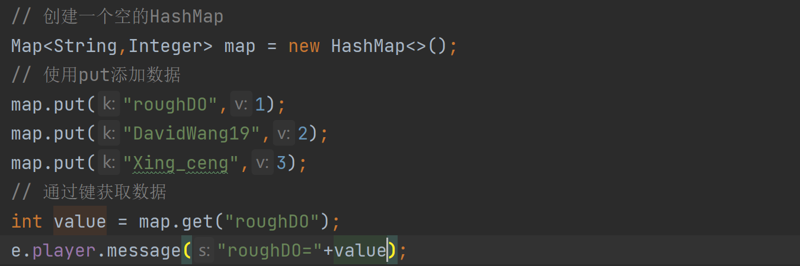

与ArrayList一样，HashMap同样不能直接使用基本类型存储数据，在HashMap中，我们定义了键的类型为String，值的类型为Integer，通过put方法添加数据，put方法中第一个参数即为键，第二个参数即为值。在get方法中传入键的名字就可以获取对应的值，如下所示。

Java由上而下执行每一条语句，这被称为顺序结构，除了顺序结构之外还有分支结构和循环结构。当你想要根据某个表达式值的不同执行不同的语句时，分支结构就登场了。分支结构的核心是 if 语句，如以下代码所示，if 语句可以根据表达式的真或假来执行不同内容。

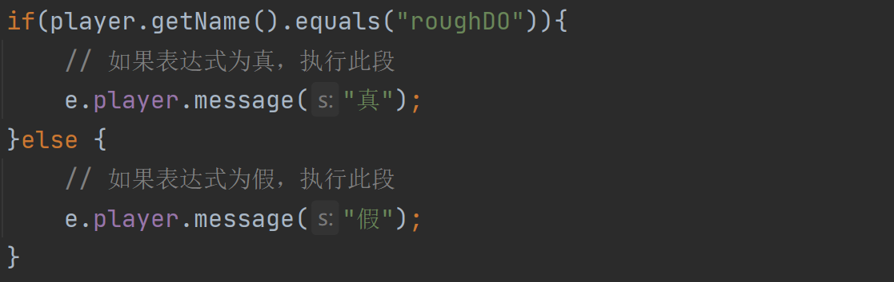

这两个不同的内容由大括号包围，一对大括号包围的语段称为一个代码块，在需要用 if 语句执行多条语句时，要使用大括号。if 语句的 else 部分可以省略不写，即只在表达式为真的情况下执行代码块内的部分。

if 语句在脚本开发的过程中非常常用，比如需要根据玩家血量的高低造成不同伤害时，就可以使用以下代码：

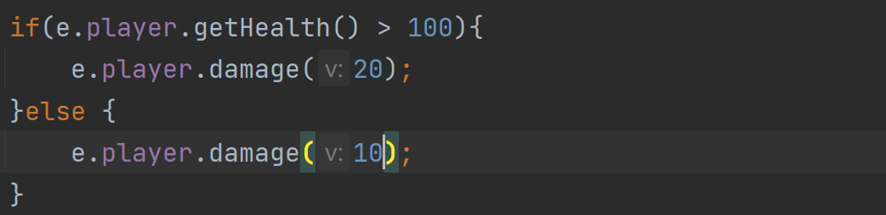

即玩家血量高于100 时造成 20 点伤害，小于时造成 10 点伤害。

循环结构顾名思义，即是程序重复循环执行一部分语句，当要对许多对象执行相同逻辑时我们便可以使用这个结构。我们首先看一个最简单的循环例子：

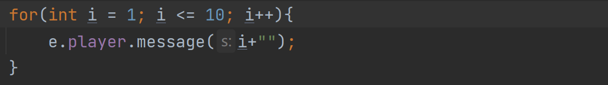

该代码的意思是让 i 变量从 1 开始每次加一到 10 为止循环十次，每次把 i 的值输出给玩家，这样玩家得到的输出结果便是从 1，2，3 一直到 10。一个最经典的循环语句如下：

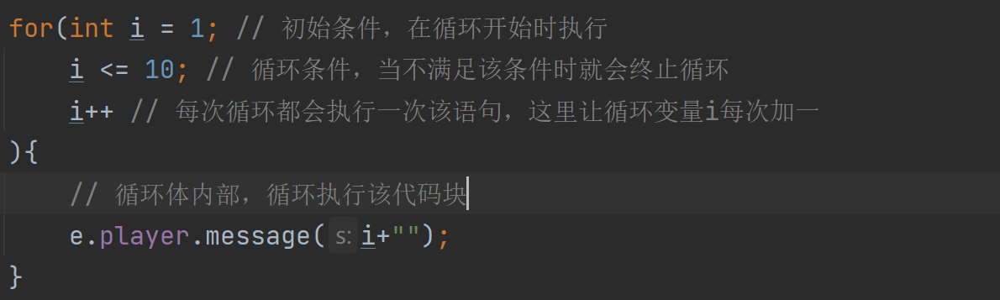

循环结构中最经典的例子就是访问数组中的每个对象，我们称之为数组的遍历。数组遍历可以用以下两种方式：

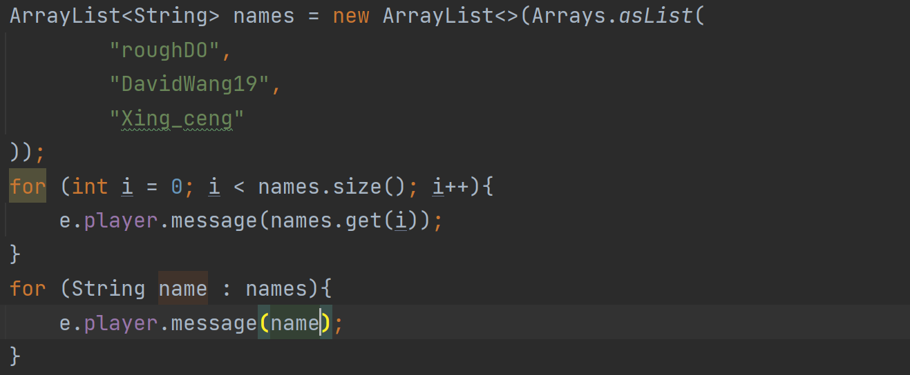

运行结果均为：

另一种常用的循环语句时 while 语句，while 语句只需满足表达式，即会一直 执行循环，如下所示，此两种写法等价：

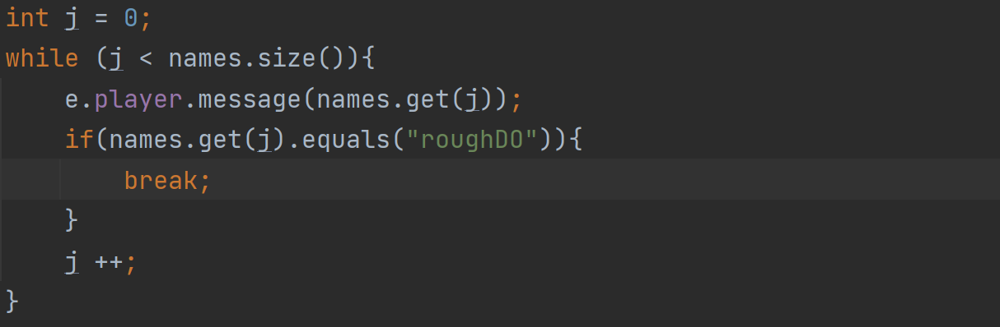

在循环中，我们可以使用 break 语句来强制结束循环，如上图，当从数组中取得的值为“roughDO”时就会跳出循环，不再继续执行接下来的内容，相对应的，你也可以使用return关键字退出整个函数。

1.  正式步入脚本开发

至此，你已经掌握了开发初级脚本的所有知识，可以开始实战脚本开发了。 在本部分中，我们将完成一个符合实际需求的脚本：位于时空管理局的多余任务自助删除 npc 的脚本。在阅读以下的具体教程之前，可以先自己尝试一下，在mc中（用 npc 魔杖）新建npc研究一下对话框系统和任务系统，也可以先去服上的时空管理局观摩一下脚本效果，随后自己动手设计脚本，卡住之后再来回看教程，这对水平的提升大有裨益。

下面是完成这一需求脚本的详细教程：

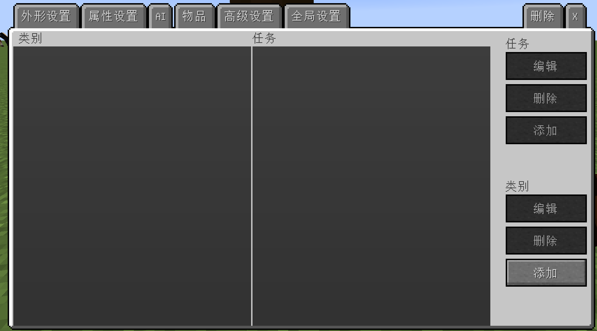

打开npc全局管理中的任务页面，我们会发现有“任务”和“类别”两栏，点击添加类别可以添加一个任务类，用于存储一类的任务，如下所示：

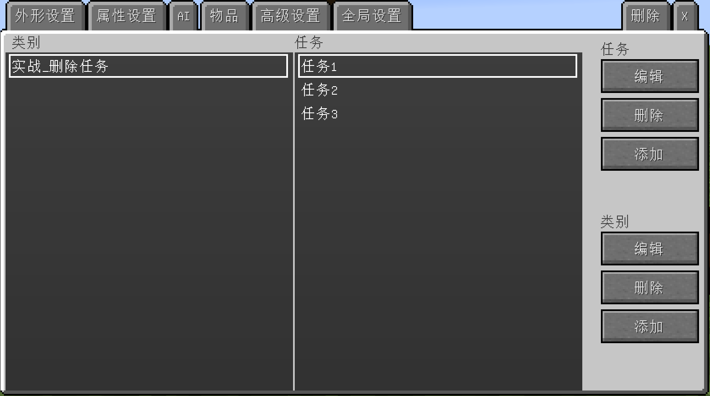

首先到api文档寻找与任务相关的方法，任务的英文名为quest，在搜索栏搜索quest就能发现与quest有关的方法，当然，因为我们的需求是“移除”任务，所以从移除这一词出发搜索也是可以的，在任务栏搜索remove就能找到移除任务的方法removeQuest。

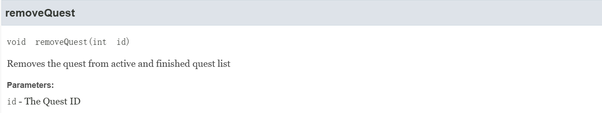

如图所示，removeQuest方法需要传递一个int类型的参数id，即任务的id，打开任务1的界面，右上角就显示了任务1的id，将id传入removeQuest即可。

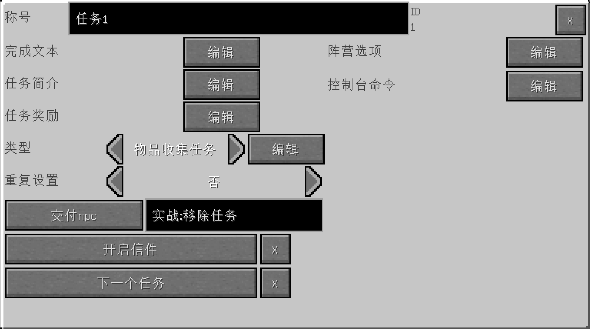

我们先来实现一个简单的任务删除。

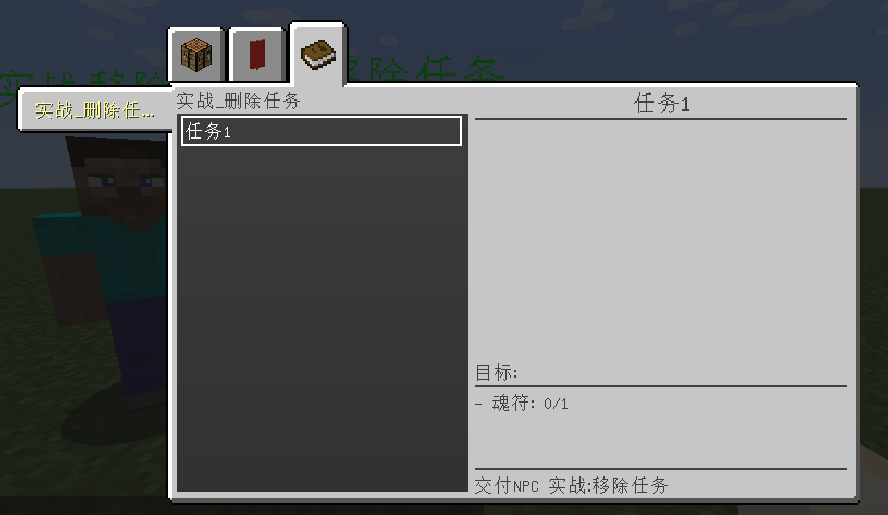

如图所示，我们接取到了任务1，打开npc脚本页面，我们编写一个通过右击互动删除任务的脚本：

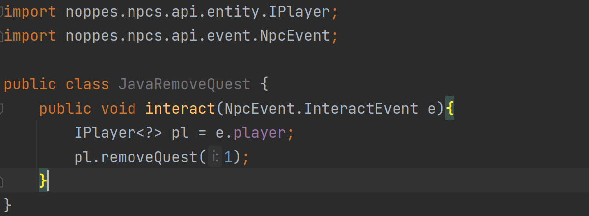

如图所示，任务顺利删除：

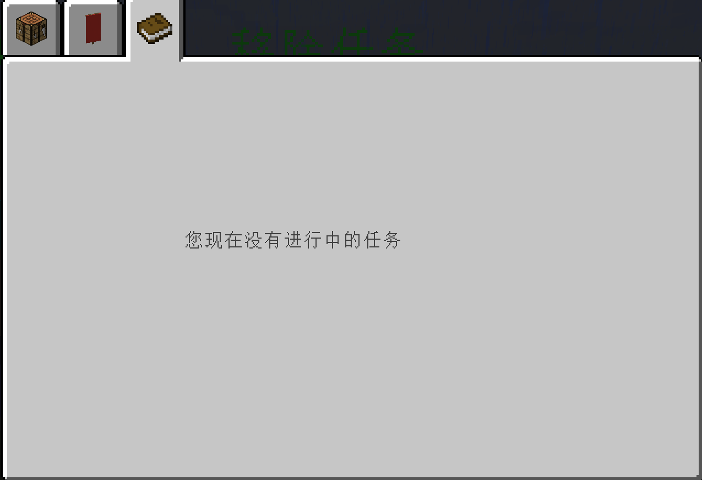

当然，顺利删除了任务不代表这个需求就被完美实现了，仔细回顾一下rpg日常，很多任务都是一次性的，而通过在api文档中对removeQuest这一方法的描述不难发现，removeQuest方法会把“在进行中的”和“完成的任务”一并移除，这里会存在一个问题，完成了该一次性任务的玩家也可以使用这个删除任务工具，而删除任务工具会删除他已经完成的任务，也就是说——玩家能不断接取一次性任务重复获得奖励。

所以，要解决这个问题，我们需要设置一个判断条件，即删除任务时，玩家的任务列表中正在进行该任务，否则就不予删除。我们在api文档搜索active就可以找到相应的方法hasActiveQuest。

据此，我们对代码进行一些修改：

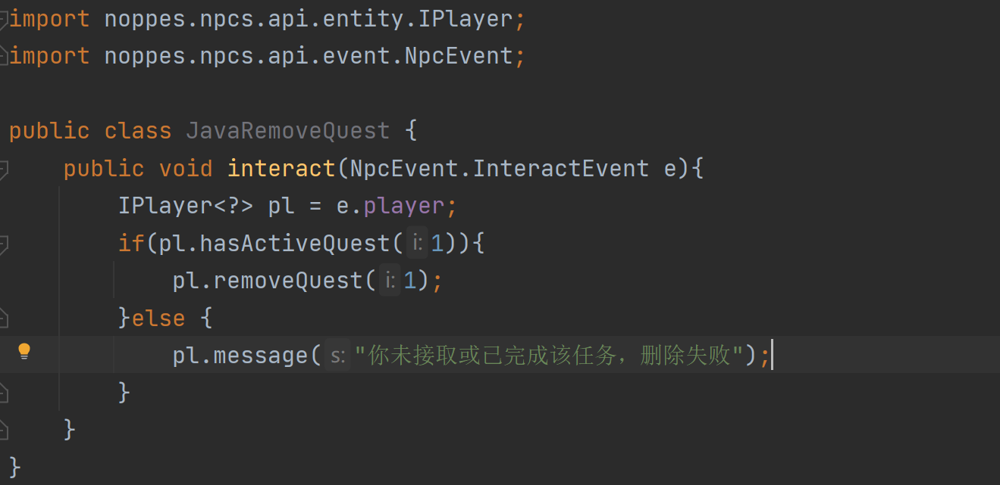

这样修改就可以避免删除已经完成的一次性任务了，因为已经完成的一次性任务是不可能再次“进行中”的。自此，删除单个任务的部分已经完成，但观察时空管理局的删除任务工具，会发现删除任务往往指的是删除某一类任务而不是某一个任务，这个又如何实现呢？很简单，我们知道任务都属于一个特定的类别，那么任务肯定有获取类别名称的方法，进入api文档的IQuest页面，我们发现了一个方法——getCategory。

顾名思义这个方法就是用来获取任务的类别的，这个方法会返回一个IQuestCategory类的返回值，我们进入IQuestCategory页面，可以发现获取类名的方法——getName。

但光有这些是不够的，你还需要获取玩家的任务列表，才能挨个检查任务属于哪些类，同样在api文档搜索quest，我们发现可以通过getActiveQuests来获取任务列表：

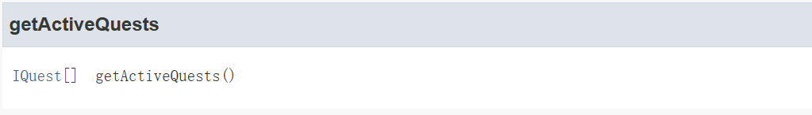

自此，删除一类任务所需的方法已经齐全了，我们对代码作出如下修改：

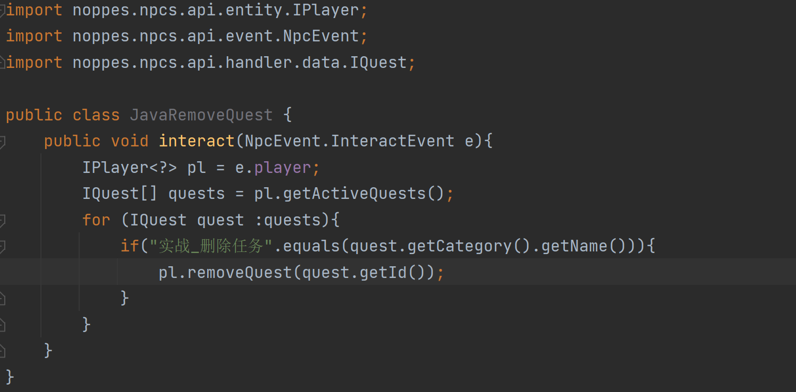

实现效果如下所示：

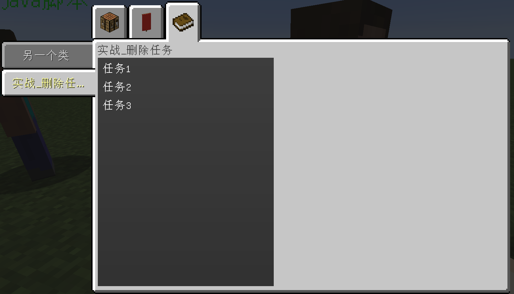

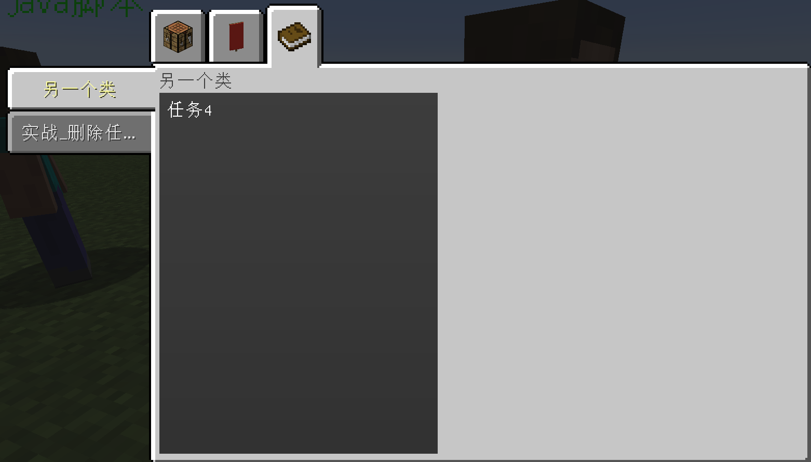

代码运行后：

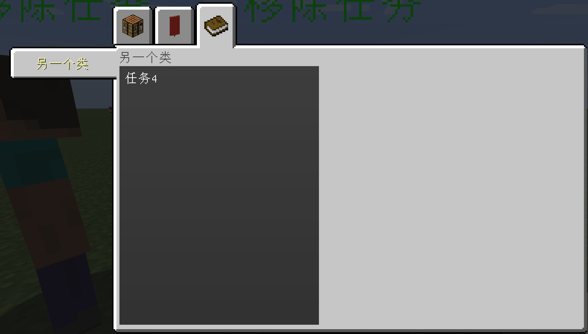

到这里，似乎功能已经全部实现了？不不不，还早呢，观察时空管理局的任务删除工具，不难发现删除是通过对话框选项进行的，而我们写的方法仅仅可以删除一个指定类下的任务而已，无法实现灵活删除特定类下的任务。

为了实现像时空管理局的任务删除npc一样的对话框选项删除指定类任务，首先在api文档中搜索与“选项”有关的词汇，比如option，之后可以发现这个钩子：

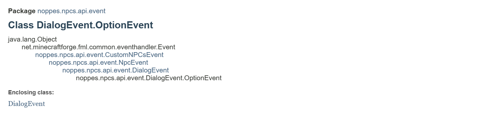

这个钩子的触发条件是，对话框选项被点击，根据这个，就可以实现我们特定类下的任务的功能啦，首先我们需要创建一个对话框用于存放我们选择的选项。

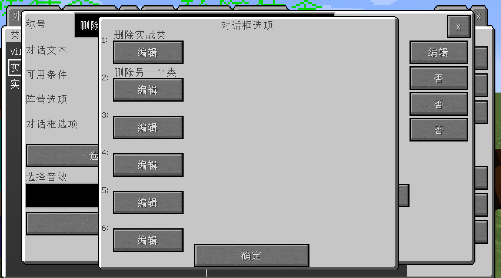

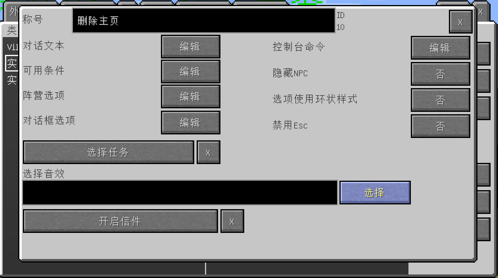

其中选项功能可以全点关闭，脚本会正常触发的这个没有关系，给npc装上对话框如图所示：

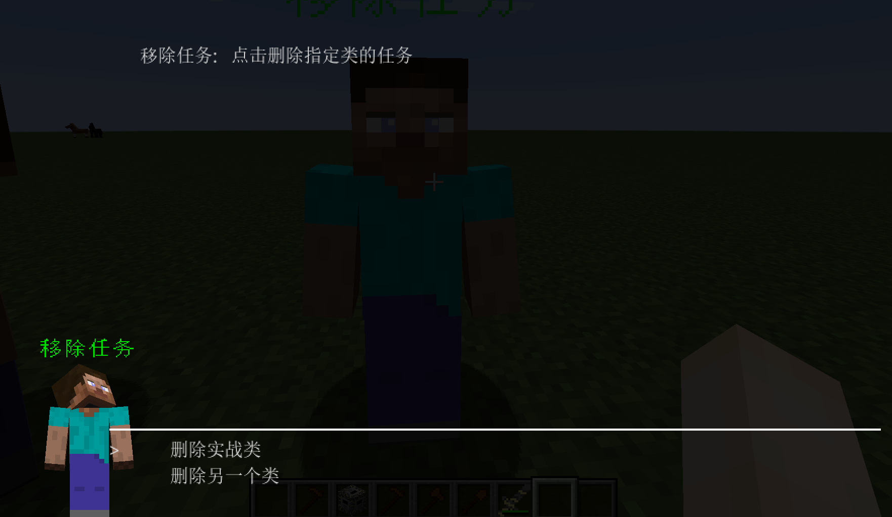

据此，我们对代码进行如下修改：

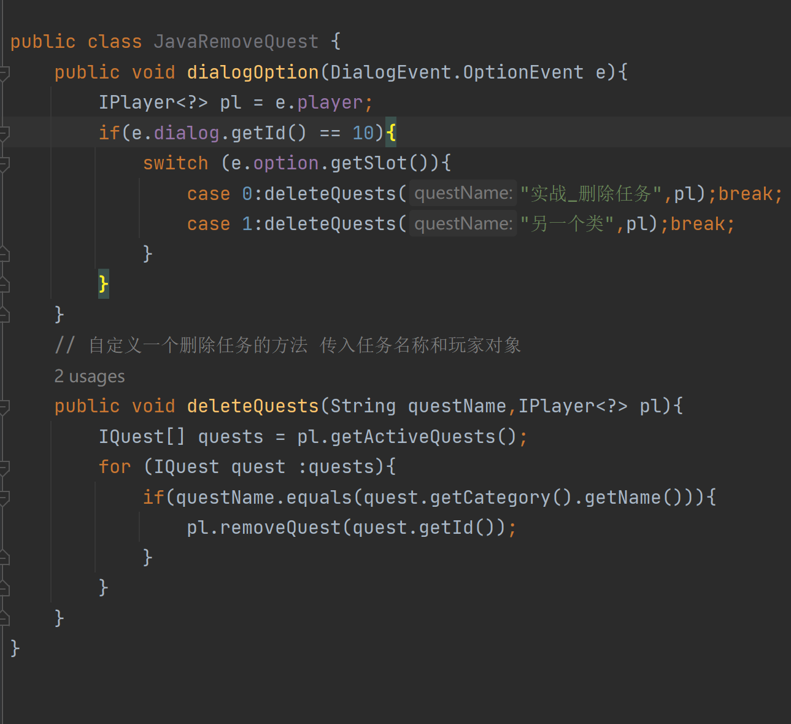

这个代码的逻辑是，首先判断触发了选项点击的对话框是哪个对话框，上面我们创建的对话框id为10，确定对话框后，再看是哪个选项触发了，这里选项的id也是从0开始算起的，也就是0是第一个选项“删除实战类”，这里使用了switch选择结构，当获取到的选项id为0时，删除实战类的任务，这里我们定义了一个自定义函数deleteQuest，定义自定义函数的好处是可以增加代码的复用性，不然上面就要写两个甚至更多个循环结构了。在deleteQuest函数中用循环结构遍历玩家任务列表，删除指定类下的任务，完成！

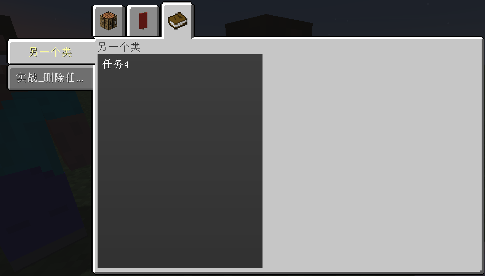

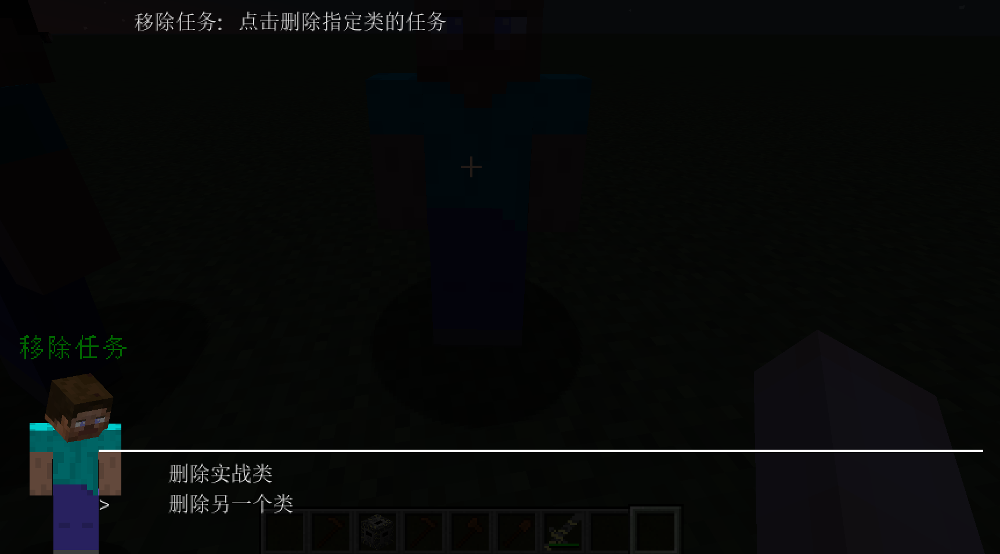

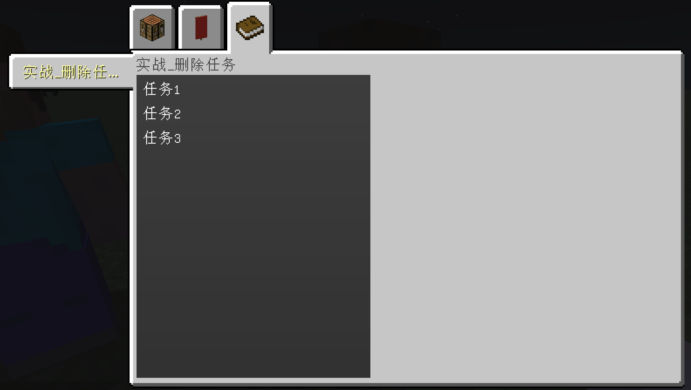

1.  考核

你已经掌握了初级脚本开发技巧，可以参加考核了！请联系 DavidWang19 （1525112788）或星层（2674708377）进行考核。考核通过后，即可加入 rpg 项目组，共同推进服务器发展进程，脚本进阶教程将在 rpg 项目组内更新，以供通过考核的新人提高所用。
